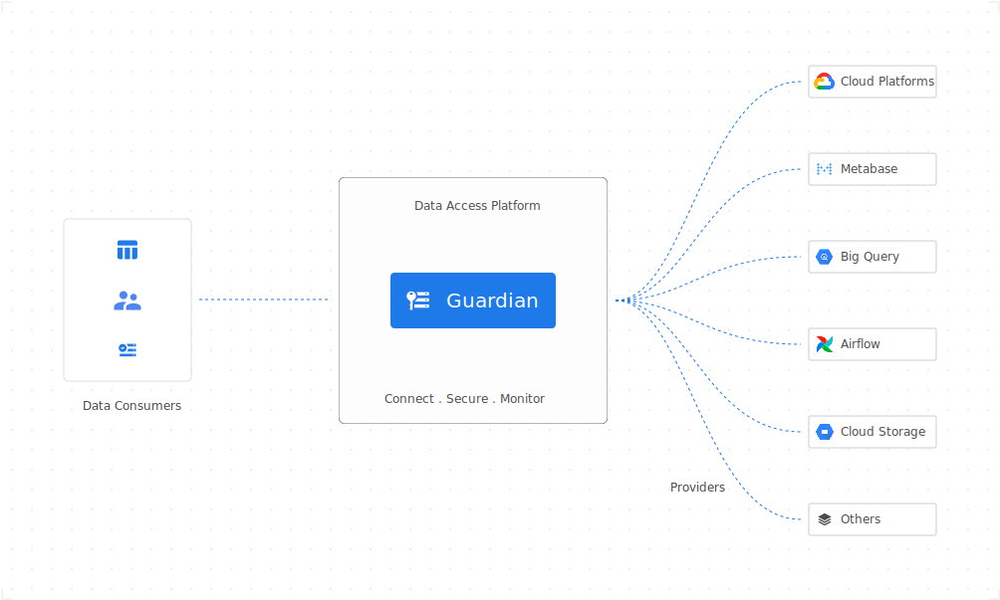

# Guardian


[](LICENSE)
[](Version)

Guardian is a on-demand access management tool. It manages resources from various data providers along with the users’ access. Users required to raise an appeal in order to gain access to a particular resource. The appeal will go through several approvals before it is getting approved and granted the access to the user.

<p align="center"></p>

## Key Features

- **Provider Management**: Support various providers (currently only BigQuery, more coming up!) and multiple instances for each provider type
- **Resource Management**: Resources from a provider are managed in Guardian's database. There is also an API to update resource's metadata to add additional information.
- **Appeal-based access**: Users are expected to create an appeal for accessing data from registered providers. The appeal will get reviewed by the configured approvers before it gives the access to the user.
- **Configurable approval flow**: Approval flow configures what are needed for an appeal to get approved and who are eligible to approve/reject. It can be configured and linked to a provider so that every appeal created to their resources will follow the procedure in order to get approved.
- **External Identity Manager**: This gives the flexibility to use any third-party identity manager. User properties.

## Documentation

Explore the following resoruces to get started with Guardian:

- [Guides](https://odpf.github.io/guardian/docs/guides/cli) provides guidance on usage.
- [Concepts](https://odpf.github.io/guardian/docs/concepts/architecture) describes all important Guardian concepts including system architecture.
- [Reference](https://odpf.github.io/guardian/docs/reference/glossary) contains details about configurations and other aspects of Guardian.
- [Contribute](https://odpf.github.io/guardian/docs/contribute/contribution) contains resources for anyone who wants to contribute to Guardian.

## Installation

Install Guardian on macOS, Windows, Linux, OpenBSD, FreeBSD, and on any machine.

#### Binary (Cross-platform)

Download the appropriate version for your platform from [releases](https://github.com/odpf/guardian/releases) page. Once downloaded, the binary can be run from anywhere.
You don’t need to install it into a global location. This works well for shared hosts and other systems where you don’t have a privileged account.
Ideally, you should install it somewhere in your PATH for easy use. `/usr/local/bin` is the most probable location.

#### Homebrew

```sh
# Install guardian (requires homebrew installed)
$ brew install odpf/taps/guardian

# Upgrade guardian (requires homebrew installed)
$ brew upgrade guardian

# Check for installed guardian version
$ guardian version
```

## Usage

Guardian CLI is fully featured but simple to use, even for those who have very limited experience working from the command line. Run `guardian --help` to see list of all available commands and instructions to use.

```
$ guardian --help
Universal access control to cloud apps and infrastructure.

USAGE
  guardian <command> <subcommand> [flags]

CORE COMMANDS
  appeal      Manage appeals
  policy      Manage policies
  provider    Manage providers
  resource    Manage resources

DEV COMMANDS
  migrate     Run database migrations
  serve       Run guardian server

ADDITIONAL COMMANDS
  completion  generate the autocompletion script for the specified shell
  config      Manage client configuration settings
  help        Help about any command
  version     Print version information

FLAGS
  --help   Show help for command

EXAMPLES
  $ guardian appeal create
  $ guardian policy list
  $ guardian provider list
  $ guardian resource list
  $ guardian policy create --file policy.yaml

ENVIRONMENT VARIABLES
  See 'guardian help environment' for the list of supported environment variables.

LEARN MORE
  Use 'guardian <command> <subcommand> --help' for more information about a command.
  Read the manual at https://odpf.github.io/guardian/

FEEDBACK
  Open an issue here https://github.com/odpf/guardian/issues
```

## Running locally

<details>
  <summary>Dependencies:</summary>

    - Git
    - Go 1.17 or above
    - PostgreSQL 13.2 or above

</details>

```sh
# Clone the repo
$ git clone git@github.com:odpf/guardian.git

# Install all the golang dependencies
$ make install

# Check all build comamnds available
$ make help

# Build meteor binary file
$ make build

# Init config
$ cp app/config.yaml config.yaml
$ ./guardian config init

# Run database migrations
$ ./guardian migrate

# Start guardian server
$ ./guardian serve
```

## Running tests

```sh
# Running all unit tests
$ make test

# Print code coverage
$ make coverage
```

## Contribute

Development of Guardian happens in the open on GitHub, and we are grateful to the community for contributing bugfixes and
improvements. Read below to learn how you can take part in improving Guardian.

Read our [contributing guide](https://odpf.github.io/guardian/docs/contribute/contribution) to learn about our development process, how to propose
bugfixes and improvements, and how to build and test your changes to Guardian.

To help you get your feet wet and get you familiar with our contribution process, we have a list of
[good first issues](https://github.com/odpf/guardian/labels/good%20first%20issue) that contain bugs which have a relatively
limited scope. This is a great place to get started.

This project exists thanks to all the [contributors](https://github.com/odpf/guardian/graphs/contributors).

## License

Guardian is [Apache 2.0](LICENSE) licensed.
