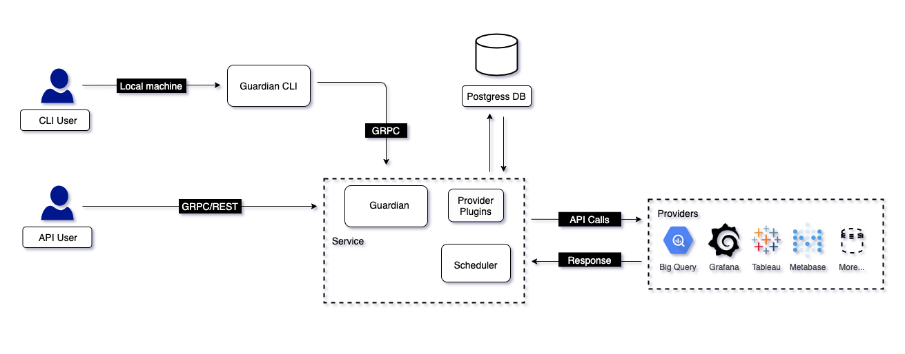

# Architecture

Basic building blocks of Guardian are
- Guardian CLI
- Guardian Service
- Guardian Database
- Guardian Providers
- Scheduler

### Guardian CLI

Guardian CLI will be able to can start a service that controls all that Guardian has to offer. Guardian CLI uses GRPC to communicate with the guardian service for almost all the operations. 

### Guardian Service

Guardian service exposes few REST endpoints that can be used with simple curl request for registering or updaing a provider, creating and granting/revoking appeals or checking the status of a appeal, creating policies etc.

### Guardian Scheduler

As soon as a provider is registered, Guardian's scheduler fetches all the resources under the provider and stores it in the guardian database. Also, the scheduler periodically checks for any new resources that re been added to a provider. It's the scheduler's duty to revoke any expired access automatically.

### Guardian Database

Provider once registered needs to be stored somewhere as a source
of truth. Guardian uses postgres as a storage engine to store the provider details, all the resource details which fall under the provider, all the policy information and appeals etc.

### Guardian Provider

Guardian itself doesn't govern how a appeal will be executed. It
only provides the building blocks. A provider for any resource type needs to be build and integrated with Guardian in order to support it's access flow. 
Any provider has 4 components
- Config - This defines the permisions and credential configuartion of a resource.
- Client - This defines the client configuartions and methods.
- Provider - This deals with the interaction with a provider.
- Resource - This defines all the resources and functions associated with them.

# Providers Supported

## 1. Grafana Provider



## 2. Metabase Provider



## 3. Bigquery Provider



## 4. Tableau Provider


