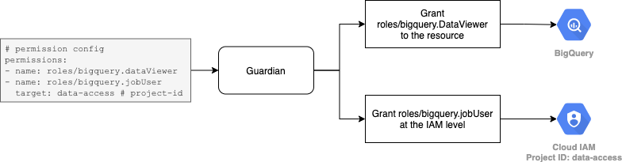

# BigQuery

BigQuery is an enterprise data warehouse tool for storing and querying massive datasets with super-fast SQL queries using the processing power of Google's infrastructure.

BigQuery has **datasets** that each one contains multiple **tables** which are used for storing the data. User also can run queries to read or even transform those data.

# Authentication

A service account is required for Guardian to access BigQuery/GCP for fetching resources as well as managing permissions. The service account key is included during the provider registration. Read more on [Registering Provider](../guides/managing-providers.md#registering-provider).

# Access Management

In Guardian, user access can be given at the dataset or table level. To give more flexibility in terms of using BigQuery, Guardian also allow user to get permission at the GCP IAM level.

## BigQuery Resources

- [Dataset Access Control](https://cloud.google.com/bigquery/docs/dataset-access-controls)
- [Table Access Control](https://cloud.google.com/bigquery/docs/table-access-controls-intro)

## GCP IAM

- [IAM Permission](https://cloud.google.com/iam/docs/granting-changing-revoking-access)