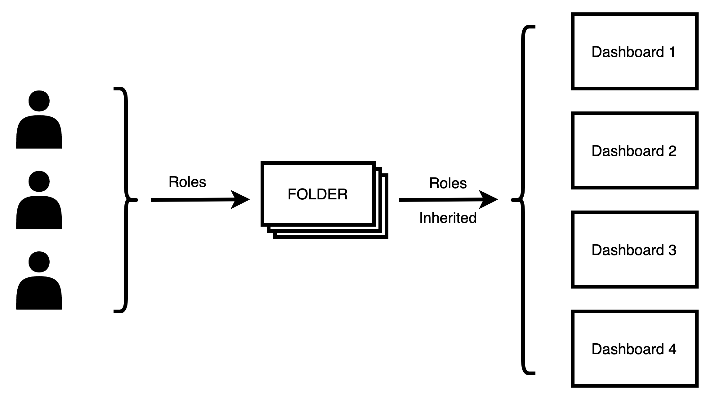
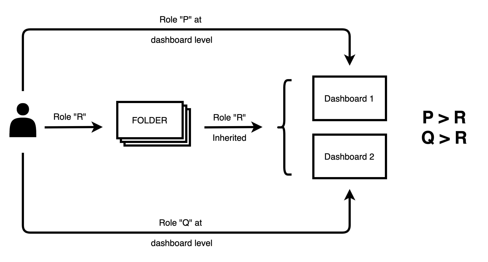
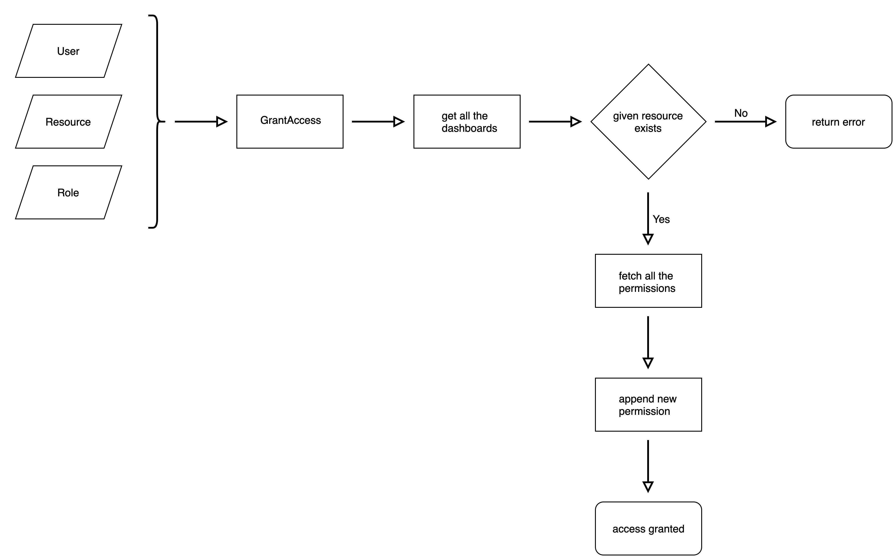

# Grafana

Grafana is open source visualization and analytics software. It allows you to query, visualize, alert on, and explore your metrics no matter where they are stored. In plain English, it provides you with tools to turn your time-series database (TSDB) data into beautiful graphs and visualizations. 

## Grafana Users

* **Users** are named accounts in Grafana with granted permissions to access resources throughout Grafana.

* **Organizations** are groups of users on a server. Users can belong to one or more organizations, but each user must belong to at least one organization. Data sources, plugins, and dashboards are associated with organizations. Members of organizations have permissions based on their role in the organization.

* **Teams** are groups of users within the same organization. Teams allow you to grant permissions for a group of users.

## Grafana Dashboards and Folders

* **Dashboards** is a set of one or more panels organized and arranged into one or more rows. Grafana ships with a variety of Panels. Each panel can interact with data from any configured Grafana Data Source.

* **Folders** are a way to organize and group dashboards - very useful if you have a lot of dashboards or multiple teams using the same Grafana instance.

## Grafana Access Flow

Grafana itself manages its user access at both *folder level* and *dashboard level*, while Guardian lets each individual user have access directly at the *dashboard level*.

* Access is based on the Role a user has on a resource.

* Roles can be either of the three:
  * Viewer
  * Editor
  * Admin

* Roles are inherited from the parent folders to a dashboard.
<p align="center"></p>

*  Although we can assign a different but higher role at the dashboard level.
<p align="center"></p>

# Authentication
Guardian requires **username** and **password** of an administrator user in Grafana.

Example provider config for grafana:
```yaml
...
credentials:
  host: http://localhost:3000
  user: admin@localhost
  password: password
...
```
Read more about grafana provider configuration [here](../reference/grafana-provider.md#config).


# Grafana Access Creation

Guardian looks for the resource we want to grant access to and append new permissions to the existing ones. In case, the resource does not exist it returns errors.

<p align="center"></p>

