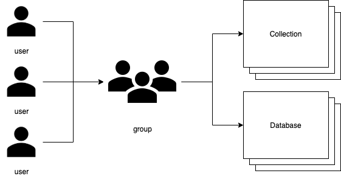
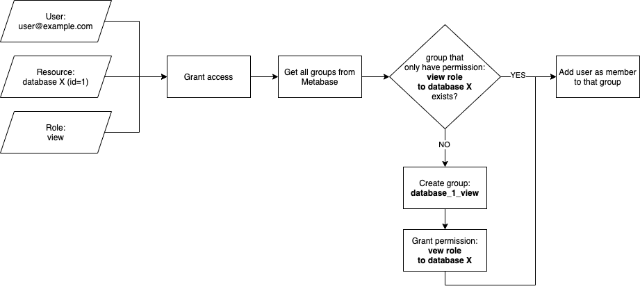

# Metabase

Metabase is a data visualization tool that lets you connect to external databases and create charts and dashboards based on the data from the databases. Guardian supports access management to the following resources in Metabase:

1. Database
2. Collection

Metabase itself manages its user access on group-based permissions, while Guardian lets each individual user have access directly to the resources.

<p align="center"></p>

# Authentication
Guardian requires **email** and **password** of an administrator user in Metabase.

Example provider config for metabase:
```yaml
...
credentials:
  host: http://localhost:12345
  user: administrator@email.com
  password: password123
...
```
Read more about metabase provider configuration [here](../reference/metabase-provider.md#config).


# Metabase Access Creation

<p align="center"></p>

Guardian creates a group that has only one permission type to one resource in Metabase
Example: If a user wants to have **view** access to **database X** (id=1), Guardian will create a group called **database_1_view**, grant it with **view** permission only to  **database X**, and then add the user to that group.

The group naming convention is:
```
<resource_type>_<resource_id>_<permission_type/role>
```
