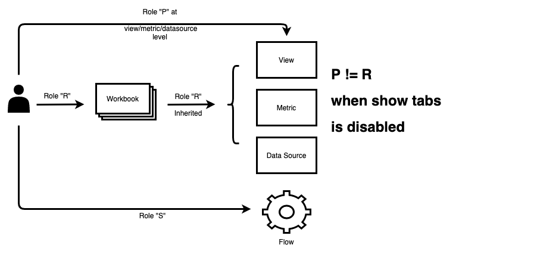

# Tableau

Tableau empowers everyone to see and understand the data. It is business intelligent for an entire organization. We can connect to any data source, be it  a spreadsheet, database or bigdata. We can access data warehouses or cloud data as well.

## Tableau resources

* **Sites** In Tableau-speak, we use site to mean a collection of users, groups, and content (workbooks, data sources) that’s walled off from any other groups and content on the same instance of Tableau Server. Another way to say this is that Tableau Server supports multi-tenancy by allowing server administrators to create sites on the server for multiple sets of users and content. All server content is published, accessed, and managed on a per-site basis. Each site has its own URL and its own set of users (although each server user can be added to multiple sites). Each site’s content (projects, workbooks, and data sources) is completely segregated from content on other sites.

* **Projects** act as folder in tableau. A content resource (workbooks and data sources) can live in only project.

* **Workbooks** in tableau are a collection of views, metrics and data sources. Guardian supports access at all the levels i.e. workbook, metrics and data sources. Workbooks have options to show or hide tabs. If it is shown, permissions to the resources below are only **inherited** from the workbook level. If it is hidden, permissions can be given at the view/metric/data source level.

* **Views** are a visualization or viz that you create in Tableau. A viz might be a chart, a graph, a map, a plot, or even a text table. Access can be granted at view level only if the parent workbook has tabs option set to hidden.

* **Metrics** are new type of content that is fully integrated with Tableau's data and analytics platform through Tableau Server and Tableau Online. Metrics update automatically and display the most recent value. Access can be granted at metric level only if the parent workbook has tabs option set to hidden.

* **Data Sources** can be published to Tableau Server when your Tableau users want to share data connections they’ve defined. When a data source is published to the server, other users can connect to it from their own workbooks, as they do other types of data. When the data in the Tableau data source is updated, all workbooks that connect to it pick up the changes. Access can be granted at data source level only if the parent workbook has tabs option set to hidden.

* **Flows** are created to schedule tasks to run at a specific time or on a recurring basis. Access can be directly granted at a flow level.

<p align="center"></p>

## Tableau Users

Tableau allows to group users into groups and manage group level access to the resources. But, Guardian allows direct user level access to any resource. 

# Authentication
Guardian requires **host**, **email**, **password** and **content url** of an administrator user in Tableau.

Example provider config for tableau:
```yaml
...
credentials:
  host: https://prod-apnortheast-a.online.tableau.com
  username: user@test.com
  password: password@123
  content_url: guardiantestsite
...
```


